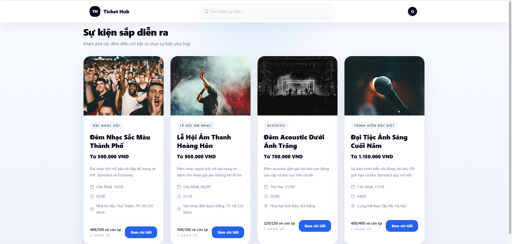
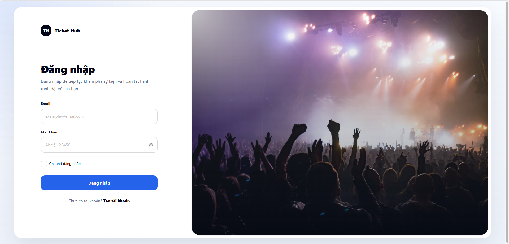
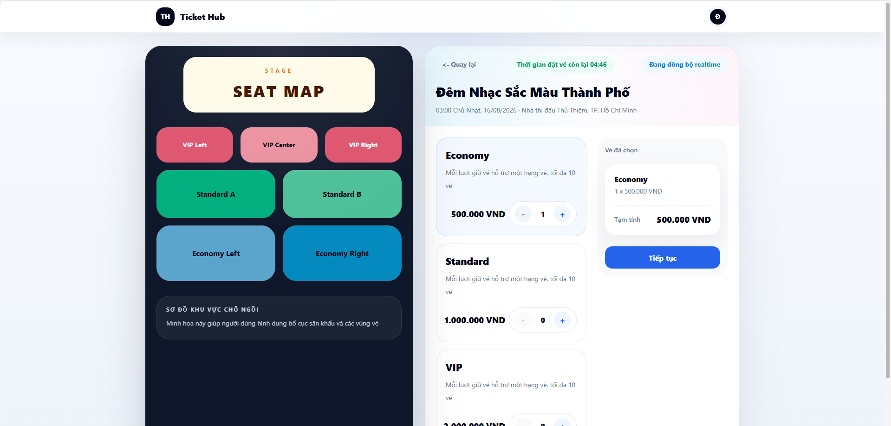
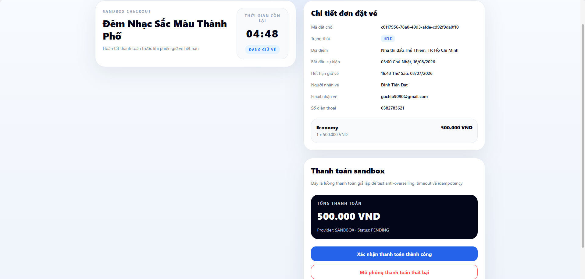
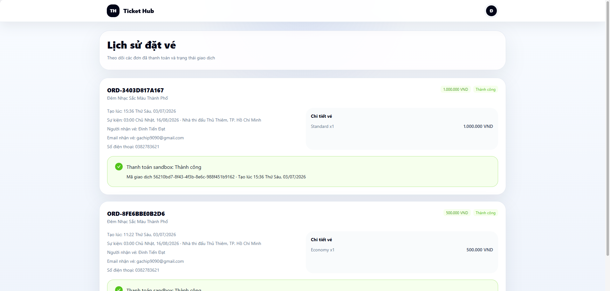
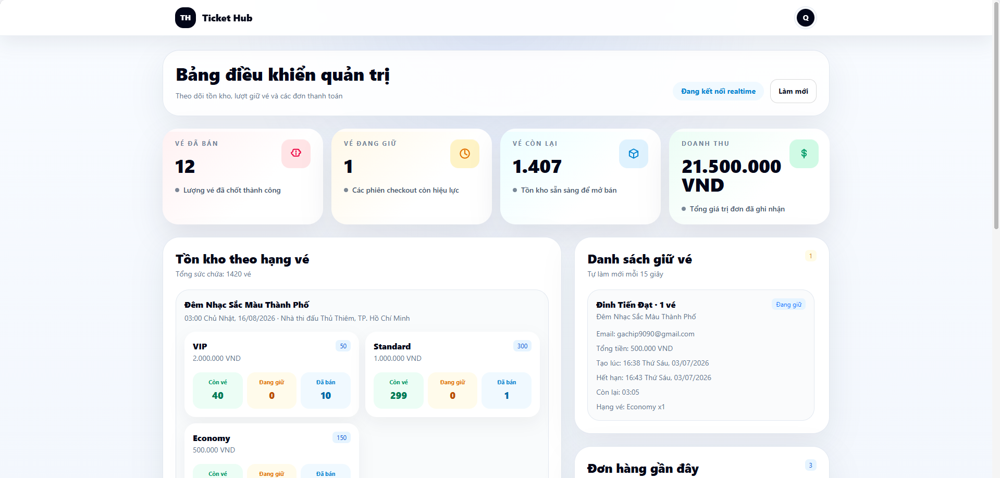

# Ticket Hub - Hệ thống đặt vé Concert

> Dự án fullstack mô phỏng hệ thống đặt vé concert giới hạn 500 vé, tập trung vào xử lý concurrency, chống overselling, giữ vé 5 phút, thanh toán sandbox, email xác nhận local, realtime inventory và admin dashboard.

## 1. Thông tin ứng viên

- Họ tên: `<Điền họ tên>`
- GitHub username: `<Điền GitHub username>`

## 2. Tổng quan dự án

Ticket Hub là monorepo gồm:

- `apps/web`: frontend Next.js cho trang sự kiện, đặt vé, checkout, lịch sử đơn hàng và admin dashboard
- `apps/api`: backend NestJS cho auth, reservation, payment, email, inventory và admin APIs
- `packages/shared`: package dùng chung cho kiểu dữ liệu / enum khi cần
- `infra/scripts`: nơi để các script hạ tầng hoặc hỗ trợ vận hành cục bộ

Các trọng tâm kỹ thuật của dự án:

- Chống overselling khi nhiều người đặt vé cùng lúc
- Giữ vé an toàn trong 5 phút
- Thanh toán sandbox có idempotency
- Cập nhật tồn kho realtime
- Gửi email xác nhận qua Mailpit local
- Cung cấp admin dashboard để theo dõi doanh thu và tồn kho

## 3. Tech stack

- Frontend: Next.js + TypeScript + Ant Design + Tailwind CSS
- Backend: NestJS + TypeScript
- Database: PostgreSQL + Prisma
- Cache / inventory hold: Redis
- Email local: Nodemailer + Mailpit
- Infra: Docker Compose
- Test: Jest

## 4. Kiến trúc tổng quát

Luồng đặt vé:

1. User đăng nhập
2. User chọn loại vé và số lượng
3. Backend hold vé trong 5 phút bằng inventory atomic
4. Reservation được lưu vào PostgreSQL
5. User xác nhận thanh toán sandbox
6. Backend chuyển số lượng từ `held` sang `sold` trong transaction
7. Backend tạo order
8. Backend gửi email xác nhận tới Mailpit
9. Frontend và admin dashboard nhận cập nhật tồn kho qua realtime stream

## 5. Seed dữ liệu

Hệ thống seed **4 concert** để phục vụ test và demo.

- Concert chính có đủ **3 loại vé**:
  - `VIP`: 50 vé, giá `2.000.000 VND`
  - `Standard`: 300 vé, giá `1.000.000 VND`
  - `Economy`: 150 vé, giá `500.000 VND`
- 3 concert còn lại là dữ liệu bổ sung để thể hiện hệ thống hỗ trợ nhiều sự kiện.

Concert chính có tổng cộng đúng **500 vé**:

| Loại vé | Giá | Số lượng |
| --- | ---: | ---: |
| VIP | 2.000.000 VND | 50 |
| Standard | 1.000.000 VND | 300 |
| Economy | 500.000 VND | 150 |
| Tổng | - | 500 |

## 6. Core invariants

```txt
available + held + sold = total_quantity
sold <= total_quantity
sold for VIP <= 50
sold for Standard <= 300
sold for Economy <= 150
total sold across all types <= 500
```

## 7. Hướng dẫn chạy local

```bash
cp .env.example .env
corepack pnpm install
docker compose up -d
corepack pnpm db:generate
corepack pnpm db:migrate
corepack pnpm db:seed
corepack pnpm dev
```

## 8. Local URLs

```txt
Frontend: http://localhost:3000
Backend API: http://localhost:3001
Mailpit: http://localhost:8025
PostgreSQL: localhost:5433
Redis: localhost:6379
```

## 9. Tài khoản demo

```txt
Admin:
  email: admin@miniticketbox.local
  password: Admin@123456

User:
  email: user@miniticketbox.local
  password: User@123456
```

## 10. Các lệnh thường dùng

```bash
docker compose up -d
corepack pnpm dev
corepack pnpm test
corepack pnpm lint
corepack pnpm build
corepack pnpm db:generate
corepack pnpm db:migrate
corepack pnpm db:seed
corepack pnpm db:reset
```

## 11. Danh sách API

```txt
POST /api/auth/register
POST /api/auth/login
GET  /api/auth/me
GET  /api/events/:id
GET  /api/events/:id/inventory
POST /api/reservations/hold
GET  /api/reservations/:id
POST /api/reservations/:id/release
POST /api/payments/sandbox/create
POST /api/payments/sandbox/confirm
POST /api/payments/sandbox/fail
GET  /api/me/orders
GET  /api/admin/stats
GET  /api/admin/reservations/held
GET  /api/admin/orders
```

## 12. Frontend routes

```txt
/
/login
/register
/events/[id]/book
/checkout/[reservationId]
/me/orders
/admin/dashboard
```

## 13. Cách chạy test

Chạy toàn bộ:

```bash
corepack pnpm test
```

Chạy các suite backend quan trọng:

```bash
corepack pnpm --filter @mini-ticketbox/api test -- reservations.service.spec.ts payments.service.spec.ts admin.service.spec.ts roles.guard.spec.ts email.service.spec.ts
```

## 14. Chiến lược chống overselling

Ticket Hub không dùng flow naive kiểu:

```txt
if available > 0:
  update available = available - quantity
```

Thay vào đó:

- Inventory hold được xử lý atomic qua Redis
- Nếu không đủ vé, backend trả `INSUFFICIENT_TICKETS`
- Reservation chỉ được thanh toán nếu vẫn còn trạng thái `HELD` và chưa hết hạn
- Payment success dùng PostgreSQL transaction + row lock
- Idempotency ngăn double click / double request tạo nhiều order
- Inventory hết hạn hoặc fail được release idempotent

## 15. Giải thích hold / release

- User phải đăng nhập trước khi giữ vé
- Thời gian hold là 5 phút
- Backend trả `expiresAt` theo server time
- Frontend countdown dựa trên `expiresAt` từ backend
- Vé đang hold không thể bị người dùng khác giữ tiếp
- Hết hạn thì inventory được trả lại

Reservation statuses:

```txt
HELD
PAID
EXPIRED
CANCELLED
```

## 16. Giải thích sandbox payment

Dự án không tích hợp cổng thanh toán thật.

Sandbox payment hỗ trợ:

- Tạo payment
- Confirm success
- Confirm fail
- Xử lý timeout / expired reservation

Payment success chỉ hợp lệ khi:

- Reservation tồn tại
- Reservation thuộc current user, trừ admin flow
- Reservation đang ở trạng thái `HELD`
- `expiresAt` vẫn còn hiệu lực
- Idempotency check pass

Payment statuses:

```txt
PENDING
SUCCESS
FAILED
TIMEOUT
```

## 17. Local email testing với Mailpit

Email confirmation được gửi qua SMTP local:

```txt
SMTP_HOST=localhost
SMTP_PORT=1025
SMTP_FROM=no-reply@tickethub.local
```

Sau khi sandbox payment thành công:

1. Mở `http://localhost:8025`
2. Tìm email mới trong Mailpit
3. Kiểm tra các trường:
   - tên concert
   - mã đơn hàng
   - email người đặt
   - loại vé
   - số lượng
   - tổng tiền
   - trạng thái thanh toán
   - thời gian tạo
   - ghi chú đây là email sandbox

## 18. Admin dashboard

Admin dashboard yêu cầu role `ADMIN` và hiển thị:

- Tổng vé đã bán
- Tổng vé đang giữ
- Tổng vé còn lại
- Tổng doanh thu
- Inventory theo từng loại vé
- Danh sách held reservations
- Recent orders / payments

## 19. Ảnh chụp màn hình

Cấu trúc thư mục:

```txt
docs/screenshots/
  .gitkeep
  home.png
  login.png
  booking.png
  checkout.png
  orders.png
  admin-dashboard.png
  mailpit-email.png
```

Placeholder trong README:

### Trang sự kiện


### Trang đăng nhập


### Trang chọn vé


### Trang checkout


### Lịch sử đơn hàng


### Admin dashboard


### Mailpit inbox


## 20. Ghi chú nộp bài

- `.env` đã được ignore trong `.gitignore`
- Hệ thống local dùng `docker-compose.yml` cho PostgreSQL, Redis và Mailpit
- Code đã được verify bằng `test`, `lint`, và `build`
